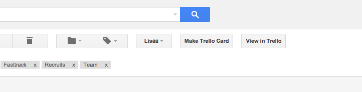

# Create Trello cards from Gmail

(Note, this is still beta. Needs refactoring and whatsoever.)

Create and check Trello cards directly from Gmail.

## Installation

1. Clone this repo locally
2. In Chrome settings (chrome://extensions/), Load unpacked extension.
